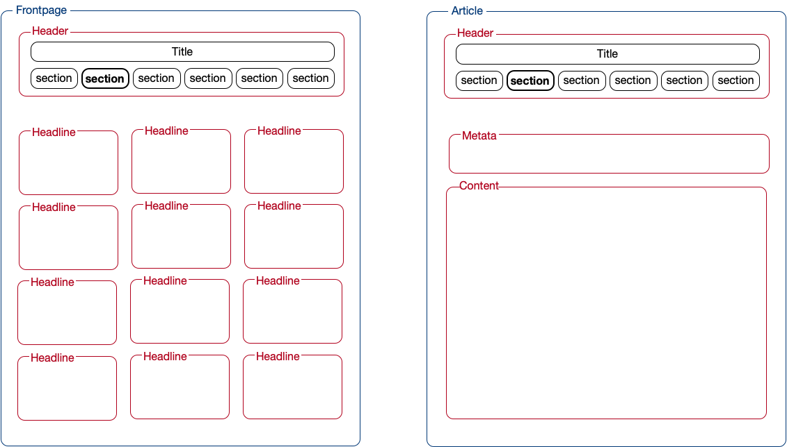
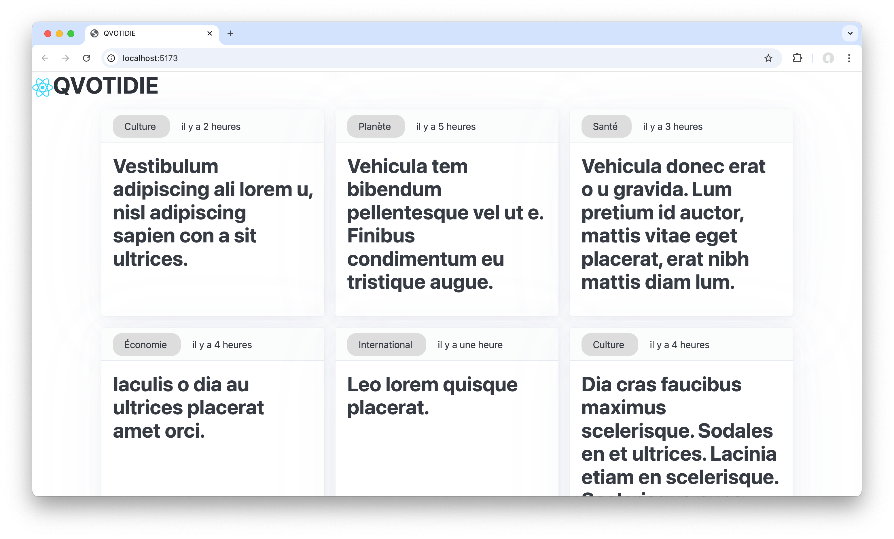
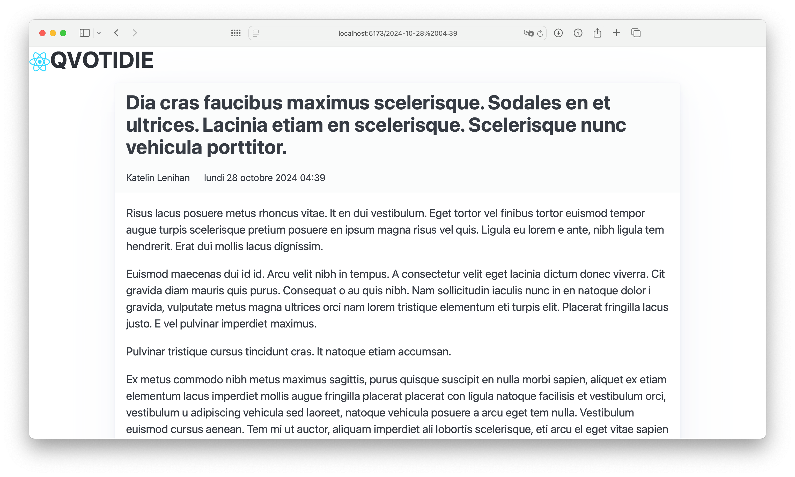

# Réduction de l'impact écologique du service numérique d'un quotidien national d'information

## Choix du sujet

Personnellement, la consultation (sur smartphone et ordinateur portable) d'un quotidien national représente environ 3h par semaine de mon "temps d'écran". Il m'a donc semblé pertinent de veiller à réduire son impact écologique.

Au-delà de mon simple exemple personnel, la presse quotidienne nationale, tous supports confondus,  représentait au premier semestre de cette année 8 millions de lecteurs ([source : ACPM](https://www.acpm.fr/Les-chiffres/Audience-Presse/Resultats-par-etudes/OneNext2/Presse-Quotidienne-Nationale)). Par ailleurs, parmi ces consultations, la part du numérique, oscille entre 30 et 80% selon les titres ([source : ACPM](https://www.acpm.fr/Les-chiffres/Audience-Presse/Resultats-par-etudes/OneNext-Global)).

## Utilité sociale

Les services qui ont le moins d'impact sont bien-sûr ceux qui n'existent pas ou plus. Cependant, dans le cas de la presse, leur utilité sociale est assez indiscutable. 

"La liberté de la presse est [...] constitutive de la démocratie". Grâce à elle, "chaque citoyen[ne] peut [...] prendre connaissance des politiques menées, les juger [...], découvrir les propositions alternatives des opposants" ([source : Service du Premier ministre](https://www.dila.premier-ministre.gouv.fr/actualites/presse/communiques/article/medias-et-democratie)).
Notons que cette liberté requiert le respect de la déontologie du métier de journaliste : vérification des faits, indépendance face aux groupes de pression.
Dans une période où le journalisme traditionnel est concurrencé par des médias qui ne partagent pas forcément la même déontologie, l'utilité sociale du journalisme nous semble encore renforcée.

## Effets de la numérisation

La numérisation de la presse quotidienne nationale a entraîné une substitution partielle par rapport au papier (entre 30 et 80% comme nous le disions plus haut). Malgré la création de nouveaux titres purement numériques de presse écrite, il ne semble pas qu'il y ait eu d'effet rebond puisqu'au contraire la diffusion totale de la presse en France s'est érodée de 30% en dix ans ([source: Rapport du Sénat](https://www.senat.fr/rap/r21-805/r21-805_mono.html#toc51)).

Le bilan en termes d'impact écologique de la substitution du papier par le numérique n'est pas facile à établir. On connaît à peu près l'impact en gaz à effets de serre de la production de l'exemplaire papier d'un quotidien régional : 200g eq. CO2 ([source : La Croix](https://www.la-croix.com/Est-ecolo-sinformer-papier-ecran-2020-11-19-1201125441)), celui d'un quotidien national est sans doute un peu supérieur en raison du transport. L'impact de la consultation d'une page Web est de l'ordre du gramme. Pour un nombre d'articles consultés de l'ordre de la dizaine, on pourrait donc penser que la numérisation réduit l'impact d'un facteur 10. Ceci est grandement à relativiser car le "taux de circulation" varie entre 4 et 8 lecteurs par exemplaire papier ([source : Wikipédia](https://fr.wikipedia.org/wiki/Presse_en_France#Lectorat_et_taux_de_circulation)).
Retenons que dans le cas qui nous occupe le support numérique est potentiellement plus vertueux que le support papier, mais que ce gain risque d'être annulé :

- si le service numérique encourage la consultation d'un nombre élevé d'articles, 
- s'il encourage fortement le partage à d'autres lecteurs,
- si l'impact des pages est supérieur à la moyenne. 

Nous serons donc particulièrement attentifs à ces trois risques dans la conception et le prototypage qui vont suivre.

## Scénarios d'usage et impacts

Nous faisons l'hypothèse que le journal est lu plusieurs fois dans la journée lors de moments de pause de quelques dizaines de minutes (dans les transports en commun, après le repas de midi, avant de se coucher, etc.).
Pour cette raison, nous prendrons en compte dans notre scénario la lecture de deux articles l'un à la suite de l'autre, afin d'apprécier l'effet bénéfique du cache.

Par ailleurs nous distinguerons la lecture des articles du jour et ceux d'une rubrique (Politique, Environnement, etc.), plus spécifiques mais possiblement plus anciens.

## Scénario : "Lire des articles parmi les articles du jour"

1. Le lecteur du journal se rend sur la "une" du journal grâce à un favori (donc sans passer par un moteur de recherche). Si nécessaire, il donne son consentement. Puis il consulte les titres.
2. Il choisit un des articles et le lit jusqu'au bout.
3. Il revient aux titres de la "une" et les consulte.
4. Il choisit un autre article et le lit jusqu'au bout.

## Scénario : "Lire des articles d'une rubrique donnée"

1. Le lecteur du journal se rend sur la "une" du journal grâce à un favori (donc sans passer par un moteur de recherche).  Si nécessaire, il donne son consentement.
2. Il choisit une des rubriques. Puis il consulte ses titres.
3. Il choisit un des articles et le lit jusqu'au bout.
4. Il revient aux titres de la rubrique et les consulte.
5. Il choisit un autre article et le lit jusqu'au bout.

## Impact de l'exécution des scénarios auprès de différents services concurrents

L'EcoIndex d'une page (de A à G) est calculé (sources : [EcoIndex](https://www.ecoindex.fr/comment-ca-marche/), [Octo](https://blog.octo.com/sous-le-capot-de-la-mesure-ecoindex), [GreenIT](https://github.com/cnumr/GreenIT-Analysis/blob/acc0334c712ba68939466c42af1514b5f448e19f/script/ecoIndex.js#L19-L44)) en fonction du positionnement de cette page parmi les pages mondiales concernant :

- le nombre de requêtes lancées,
- le poids des téléchargements,
- le nombre d'éléments du document.

Nous avons choisi de comparer l'impact des scénarios sur les services de quotidiens nationaux de diverses sensibilités politiques, économiques et environnementales : Le Figaro, Le Monde, La Croix, Libération, L'Humanité et enfin Reporterre, à titre de comparaison, même si ce n'est pas à proprement parler un quotidien.

| Service | Score (sur 100) | Classe | Détail des mesures
| --- | --: | --: | --:
| Le Figaro | 33 | E 🟥 | […](./benchmark/LeFigaro/ecoindex-environmental-statement.md)
| Le Monde | 47 | D 🟧 |  […](./benchmark/LeMonde/ecoindex-environmental-statement.md)
| La Croix | 27 | E 🟥 | […](./benchmark/LaCroix/ecoindex-environmental-statement.md)
| Libération | 35 | E 🟥 | […](./benchmark/Liberation/ecoindex-environmental-statement.md)
| L'Humanité | 17 | F 🟪 | […](./benchmark/LHumanite/ecoindex-environmental-statement.md)
| Reporterre (à titre de comparaison) | 55 | D 🟧 | […](./benchmark/Reporterre/ecoindex-environmental-statement.md)

Tab.1 : Mesure de l'EcoIndex moyen de services de quotidiens nationaux.

Les mesures de l'impact moyen de ces services (cf. Tab.1) révèlent des classes EcoIndex très faibles pour la plupart (E ou F) et médiocres pour certains (D).

Dans le détail, les pages les plus mal classées sont celles qui incluent : 

- une vidéo,
- des traqueurs en très grand nombre (pour la revente de données de consultation à des tiers),
- des publicités en grand nombre.

À l'inverse, le bon classement (B) de certaines pages (rubriques, articles) de Reporterre montre qu'il existe une marge de progression significative à condition d'adopter des pratiques d'éco-conception et un modèle économique permettant de réduire (totalement ou partiellement) le recours à des services tiers de traqueurs et de publicité.

## Modèle économique

Comme nous l'avons vu dans la section précédente, parmi les choix de conception ayant le plus d'impact environnemental, la plupart sont directement liés au modèle économique du service.
C'est pourquoi il est nécessaire à ce stade d'analyser leur modèle économique et de définir notre propre modèle permettant une conception plus frugale.  

| Service | Visiteur anonyme | Abonné
| --- | --- | ---
| Le Figaro | <ul><li>Publicités (régie tierce)</li><li>Suivi</li></ul> | <ul><li>Lire tous les articles</li><li>Commenter</li><li>Propositions d'événements culturels</li></ul> 
| Le Monde | <ul><li>Publicités (régie tierce)</li><li>Suivi</li></ul> | <ul><li>Lire tous les articles</li><li>Commenter</li><li>Spotify Premium</li></ul> 
| La Croix | <ul><li>Publicités (régie intégrée)</li><li>Publicités (régie tierce)</li><li>Suivi</li></ul> | <ul><li>Lire tous les articles</li></ul>
| Libération | <ul><li>Publicités (régie tierce)</li><li>Suivi</li></ul> | <ul><li>Lire tous les articles</li></ul>
| L'Humanité | <ul><li>Publicités (régie tierce)</li><li>Suivi</li></ul> | <ul><li>Lire tous les articles</li><li>Lire les archives depuis 1990</li></ul>
| Reporterre (à titre de comparaison) | <ul><li>Lire tous les articles</li></ul> | Sans objet (mais dons possibles)

Tab. 2 : Offre des services de quotidiens nationaux.

Les offres de service numérique des quotidiens nationaux (cf. Tab. 2 ) se sont harmonisées autour d'un modèle dit "freemium" (de *free*, gratuit, et *premium*, supplément) :

- un accès gratuit à certains articles (ou en nombre limité), financé par la publicité,
- un accès à l'ensemble des articles, sans publicité, réservé aux abonnés.

Certains acteurs se distinguent en offrant en outre aux abonnées l'accès à d'autres services (événements culturels, musiques en streaming, commentaires), numériques ou non, susceptibles d'augmenter, à des degrés divers, l'impact environnemental de l'offre.

Le seul modèle alternatif, est celui de *Reporterre*, totalement gratuit mais basé sur des dons. Il est possible que sa fréquence de publication plus basse que celle d'un quotidien (seulement 6 articles par jour en septembre 2025), requière le travail de moins de journalistes à temps plein.

| Source possible de revenus | Montant unitaire | Quantité nécessaire pour financer un salaire[^salaire]
| --- | --: | --:
| Abonnement | 12€ [^abonnement] | 297
| Affichage d'une publicité (régie tierce) | 0,00046€ [^RPM] | 7 758 696 
| Diffusion d'une publicité (régie intégrée) | 10 000€ [^encart] | 0,35

Tab. 3 : Source de revenus possibles pour le service d'un quotidien national.

[^1]: Moins si engagement annuel.
[^abonnement]: Basé sur l'abonnement mensuel du *Figaro* et du *Monde* (12,99€), de *La Croix* (12,90€), de *Libération* (11,90€), de *L'Humanité* (11€), 
[^salaire]: Basé sur le coût total employeur du salaire médian 2025 soit 3569€ environ (source : [URSSAF](https://mon-entreprise.urssaf.fr/simulateurs/salaire-brut-net)) 
[^encart]: Basé sur le prix d'un bandeau court à la une d'un numéro de *La Croix* (source : [Bayard](https://www.bayardmediadeveloppement.com/wp-content/uploads/2024/08/2024.10.02-TARIFS-LA-CROIX-2025.pdf)) en 80 000 exemplaires papier et 80 000 vues sur le site (source : [Bayard](https://www.bayardmediadeveloppement.com/wp-content/uploads/2024/08/2025.008-Galaxie-LaCroix.pdf)).
[^RPM]: L'estimation utilisée ici est basée sur le revenu pour mille vues en Allemagne en 2023 (source : [AdCPMRates](https://adcpmrates.com/2022/09/07/adsense-cpm-and-cpc-rates-in-germany-2023/).

L'étude de l'offre des quotidiens nous a permis d'identifier les sources de revenu communément utilisées (cf Tab. 2). Associées à un bref état de l'art (cf. Tab.3), nous avons pu établir que :

1. le suivi des parcours des visiteurs n'est, apparemment, pas rémunérateur en lui-même mais fait partie de l'affichage des publicités ;
2. les deux principaux modèles de revenu concernant la diffusion d'une publicité distribuée par une régie tierce sont le revenu pour mille vues (RPM) et le revenu par clic ; le second se généralisant pour la partie contractuelle, le premier est souvent donné comme une simple estimation basée sur le taux de clic moyen ;
3. la diffusion d'une publicité gérée par une régie intégrée à un quotidien existant sous forme numérique et "papier" est incomparablement plus rémunératrice, que par une régie tierce.
4. un modèle par abonnement semble adapté à financer les salaires des journalistes d'un quotidien à diffusion nationale.

Par conséquent, pour réduire l'impact écologique du service, nous proposons de :

- de renoncer aux publicités gérées par une régie tierce,
- d'adopter un modèle basé principalement sur les abonnements,
- de le compléter par un bandeau publicitaire (pour les non abonnés) géré par une régie intégrée.

## Maquette de l'interface et échantillon de données

Au vu des différents services comparés, des exigences environnementales exprimées plus haut et des scénarios retenus, nous avons défini pour notre prototype une maquette de l'interface et un échantillon de données réalistes.

Les ressources Web possédant une représentation sur notre application seront de deux types :

- la "une" du journal (avec une HTTP-URI ayant pour chemin `/`) ou, plus spécifiquement, d'une rubrique thématique (avec pour chemin `/?topic={name}`),
- un article du journal (avec pour chemin `/{id}`).

__Fig.1__: Maquette de l'interface du prototype : __a.__ type de page pour les "titres" (du jour ou d'une rubrique), __b.__ type de page d'un article.

Dans un objectif de sobriété environnementale, les articles sont pour l'instant limités à ceux du jour et de la veille (soit 20 à 30 articles).

Pour des raisons de respect des droits d'auteurs, nous utilisons des données générées (avec [`dummy-json`](https://dummyjson.com)).
Bien que fictives, ces données correspondent à la structure des services concurrents : les articles comportent un titre possiblement long, un auteur et une rubrique (voir [modèle de données](https://github.com/UTT-GL03/QVOTIDIE/blob/4f893a869c19a1244e0bdc260b16c39337d06b09/frontend/sample_data.hbs)). 

## Implémentation du scénario prioritaire

### Étape de prototypage : Données chargées de manière statique

Pour cette première version du prototype (`v1.0.0`) :

- l'échantillon de données est encore chargé dans le code de manière statique,
- les fonctionnalités implémentées ne sont que celles nécessaires pour suivre le scénario prioritaire ("Lire des articles parmi les articles du jour").

Ce scénario nécessite de pouvoir naviguer entre deux types de page : la page des titres et les pages des articles.

### Page des titres

Nous avons développé la page des titres (cf. Fig. 2) pour qu'elle affiche l'échantillon de données sous une forme proche de ce que prévoyait la maquette.

__Fig.2__: Prototype de la page des titres.

Pour l'instant, nous avons choisi un *framework* de mise en page minimaliste ([*PicoCSS*](https://picocss.com)).
Dans la suite du projet, nous verrons si l'impact environnemental du passage à un *framework* de mise en page plus puissant (comme [*Bootstrap*](https://getbootstrap.com)) est acceptable.

De même, nous avons décidé, contrairement à l'ensemble des services concurrents, de ne pas inclure de photographies dans cette page.
Même si ces photographies ont probablement un impact sur l'attention portée à un article, elles ne sont pas strictement requises pour la consultation des titres et ne sont donc pas incluses dans le produit minimum viable.
Si une telle fonctionnalité devait par la suite être introduite, il faudrait mettre en balance son utilité et son impact *a priori* important.
En effet, à moins de mettre en place des techniques avancées d'optimisation (et possiblement ambivalentes) comme les [*sprites* en CSS](https://fr.wikipedia.org/wiki/Sprite_(jeu_vidéo)#Sprite_CSS) ou le multiplexage dans [HTTP/2](https://en.wikipedia.org/wiki/HTTP/2) (cf. Wikipédia), une requête supplémentaire est nécessaire pour chaque image.

Dans l'état actuel du prototype, il est possible d'avoir une première idée de l'impact environnemental du *frontend*.
Bien entendu, il manque encore le chargement dynamique des données, mais nous pouvons déjà évaluer l'impact de l'affichage des données et du *framework* (au sens large : *React*, *PicoCSS*, *DayJS*).
Cette évaluation de l'impact (cf. Tab.4) est déjà encourageante en mode "développement" mais encore plus en mode "pré-production".
Nous mesurons ici l'effet positif de l'adoption d'outils de développement Web intégrant la ["minification"](https://fr.wikipedia.org/wiki/Minification) (cf. *Wikipédia*) du code et la concaténation du code d'une part et des feuilles de style d'autre part.

|   | EcoIndex| GES (gCO2e) | Taille du DOM | Requêtes | Taille de la page (ko)
|---|--------:|------------:|--------------:|---------:|---------------------:
| Mode "développement"  | 75 B 🟩 |  1,5 | 191 | 26 | 2232
| Mode "pré-production" | 88 A 🟦 | 1,2 | 190 | 4 | 125

__Tab.4__: Évaluation de l'impact du prototype de la page d'accueil.

### Pages des articles

Les pages des articles ont pour HTTP-URI `/{id}`.
Comme l'échantillon de données ne comportait pas d'identifiants pour les articles, nous avons adopté pour l'instant leur horodatage en tant qu'identifiant.

De même que précédemment, nous avons tenté d'implémenter cette page (cf. Fig. 3) conformément à ce que prévoyait la maquette.
Notons que nous n'avons pas inclu le choix des rubriques puisque cette fonctionnalité n'est pas incluse dans le scénario prioritaire.

__Fig.3__: Prototype de la page d'un article.

Avec l'ajout de ce modèle de page et la mise en place de la navigation entre les deux modèles, il devient possible d'exécuter le scénario prioritaire complet et de mesurer son impact.

|   | EcoIndex| GES (gCO2e) | Taille du DOM | Requêtes | Taille de la page (ko)
|---|--------:|------------:|--------------:|---------:|---------------------:
| 1. Consulter les titres 					   | 88 A 🟦 | 1,2 | 190 | 4 | 125
| 2. Choisir et lire un article 			   | 96 A 🟦 | 1,1 |  24 | 4 | 1
| 3. Revenir aux titres et les consulter	| 89 A 🟦 | 1,2 | 190 | 4 | 1
| 4. Choisir et lire un autre article 		| 96 A 🟦 |  1,1|  22 | 4 | 1

__Tab.5__: Évaluation de l'impact du scénario "Lire des articles parmi les articles du jour" dans le prototype v1.0.0.

Ces estimations bien qu'artificiellement basses (puisque les données sont chargées de manière statique) sont tout de même à comparer avec [celles des services concurrents](https://htmlpreview.github.io/?https://raw.githubusercontent.com/UTT-GL03/QVOTIDIE/main/benchmark/benchmark.html) vues précédemment.

Si nous arrivons à maintenir les émissions en dessous de 1,3 g par page pour notre produit minimum viable, nous pouvons donc espérer proposer une alternative environ 2 fois moins impactante que les services existants (en incluant pourtant la participation au cycle de vie du terminal).

### Étape de prototypage : Données statiques chargées de manière dynamique

Pour cette nouvelle version du prototype (`v1.0.1`), identique du point de vue fonctionnel, les données (toujours statiques) sont désormais chargées par le *frontend* à travers le réseau immédiatement après un premier affichage à vide.
Ce comportement, plus réaliste, n'a pour effet qu'une requête supplémentaire par page affichée. 

Concernant l'évaluation de l'impact environnemental du scénario, par rapport au tableau précédent (cf. Tab.5), à l'exception du nombre de requêtes qui est incrémenté de 1, les résultats sont strictement identiques.

## Mesures de la consommation énergétique lors du passage à l'échelle

Maintenant que notre prototype est réaliste en termes de nombre de requêtes, nous pouvons simuler les effets du "passage à l'échelle". 

Dans le cas qui nous occupe de la presse quotidienne et dans le cadre des fonctionnalités envisagées (consultation d'articles), l'augmentation de la quantité des données à traiter ne viendra ni de l'augmentation du nombre de journalistes ni même de celle  des lecteurs.
Par contre, il est d'usage sur les applications de presse d'avoir accès aux archives du journal,
le but étant d'éclairer l'actualité à la lumière du passé plus ou moins proche.
Cette exigence fonctionnelle bien que coûteuse du point de vue environnemental nous semble contribuer grandement à l'utilité sociale de la plateforme.
Par conséquent nous adopterons également ce choix de conception.

L'augmentation du volume d'articles est linéaire : à raison de 25 nouveaux articles par jour, la base de données sera de 3000 articles au bout de 4 mois (et ainsi de suite).

### Évolution de l'EcoIndex lors du passage à l'échelle

Produites désormais de manière automatique lors de l'intégration continue, les mesures nécessaires à la production de l'EcoIndex, [avant](https://github.com/UTT-GL03/QVOTIDIE/actions/runs/19211909192/artifacts/4512754147) et [après](https://github.com/UTT-GL03/QVOTIDIE/actions/runs/19224015758/artifacts/4516341581) la simulation du passage à l'échelle retraduisent bien (cf. Tab.6) l'augmentation du poids des téléchargements, mais aussi de l'augmentation du nombre d'éléments de la page des titres.

|   | EcoIndex| GES (gCO2e) | Taille du DOM | Requêtes | Taille de la page (ko)
|---|--------:|------------:|--------------:|---------:|---------------------:
| 1. Consulter les titres 					   | <del>81 A 🟦</del> 29 E 🟥 | <del>1,4</del> 2,4 | <del>198</del> 19 014 | 6 | <del>446</del> 11 400
| 2. Choisir et lire un article 			   | <del>90 A 🟦</del> 76 B 🟩 | <del>1,1</del> 1,5 | 30 | 2 | <del>115</del> 10 800
| 3. Revenir aux titres et les consulter	| <del>83 A 🟦</del> 30 E 🟥 | <del>1,3</del> 2,4 | <del>198</del> 19 014 | 2 | <del>115</del> 10 800
| 4. Choisir et lire un autre article 		| <del>90 A 🟦</del> 76 B 🟩 |  <del>1,2</del> 1,5 | 26 | 2 | <del>115</del> 10 800

__Tab.6__: Effet du passage à l'échelle sur l'impact du scénario "Lire des articles parmi les articles du jour" dans le prototype v1.0.1.

On pourrait s'étonner que la baisse de l'EcoIndex soit beaucoup plus forte pour la page des titres que pour la page d'un article alors que l'augmentation du poids des téléchargements est analogue.
Ceci s'explique par le fait que l'EcoIndex vise à évaluer un impact global, incluant une part de la fabrication et de la fin de vie des terminaux, et que cette part augmente avec le nombre d'éléments de la page.
Pour évaluer plus précisément l'impact de la consultation elle-même nous utiliserons un autre outil de mesure : GreenFrame.
