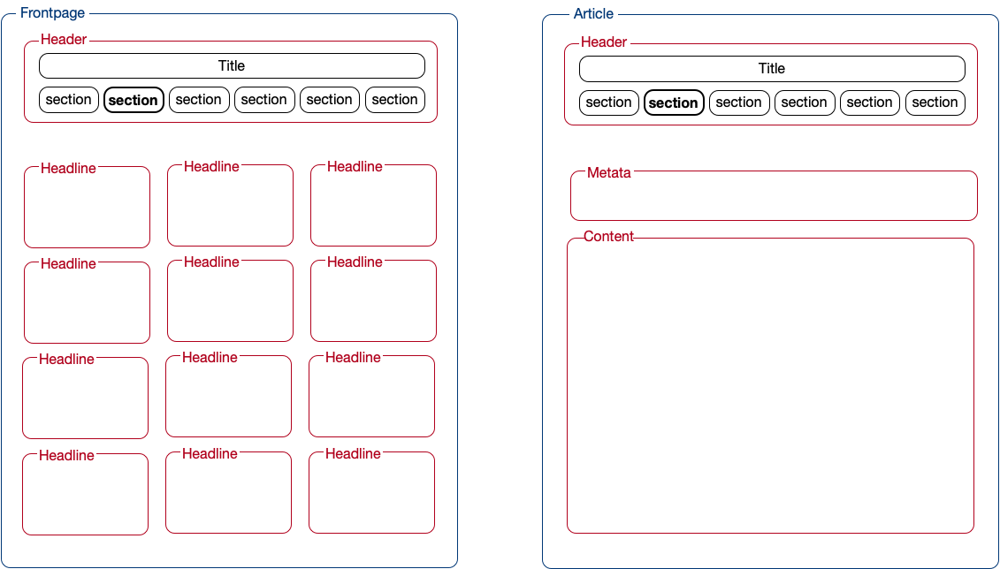
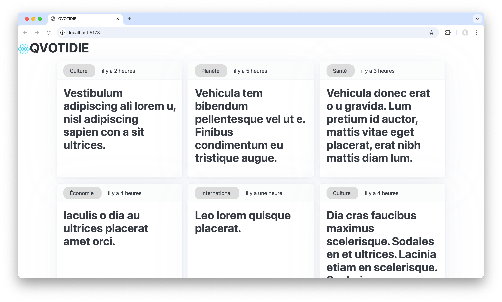
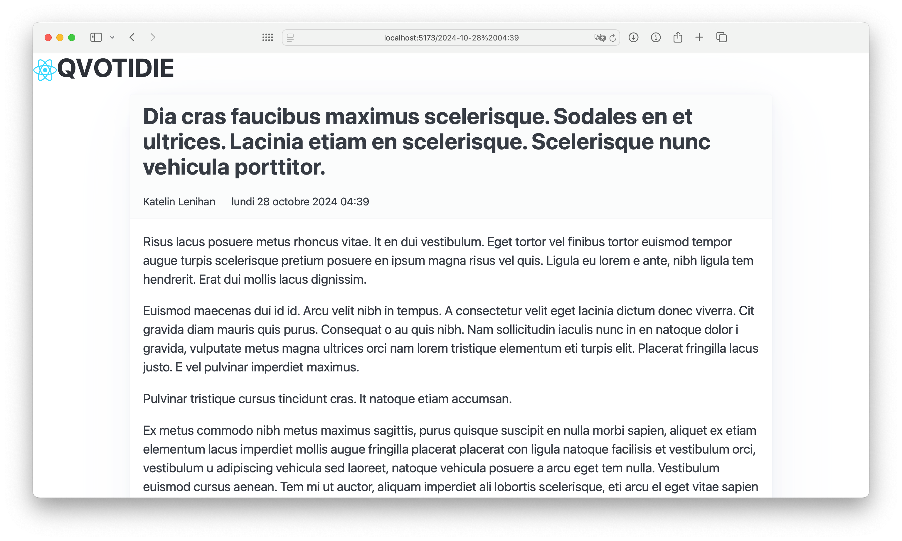
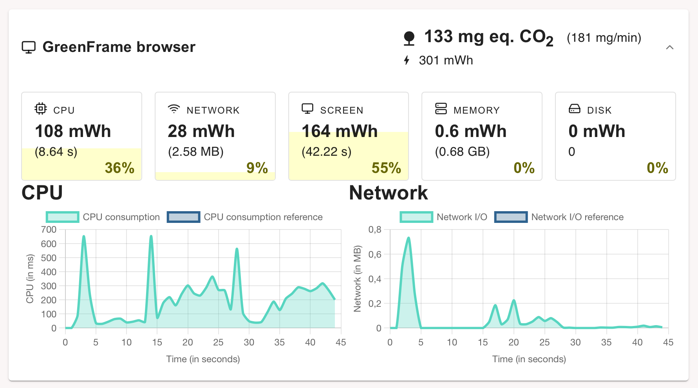
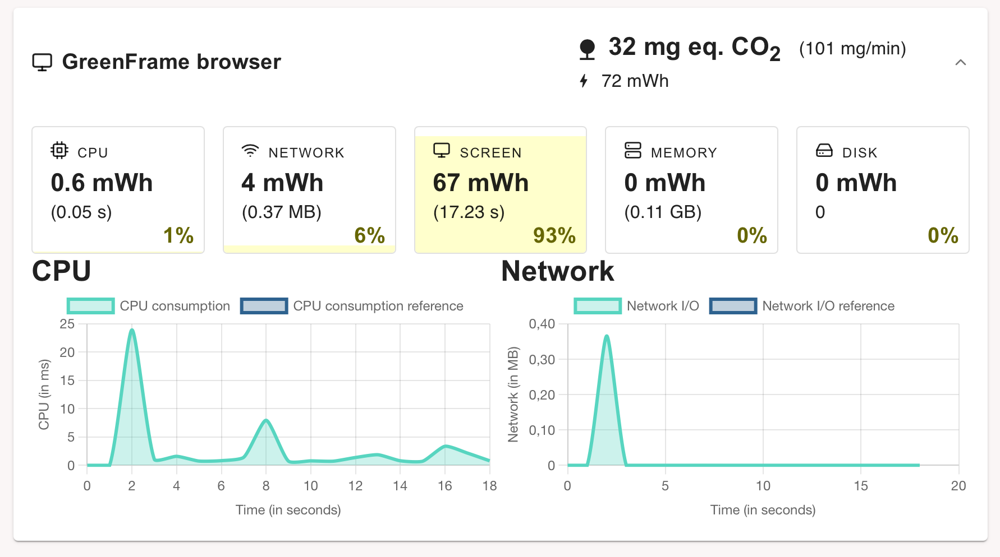
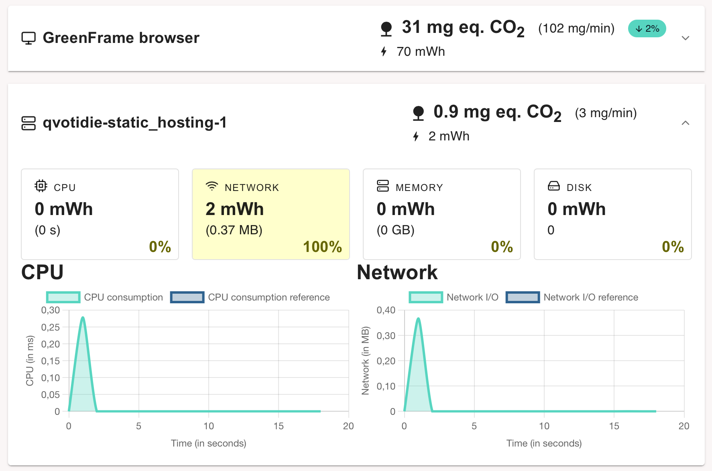
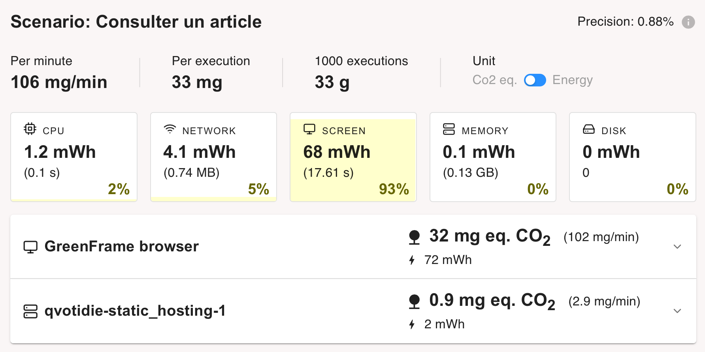
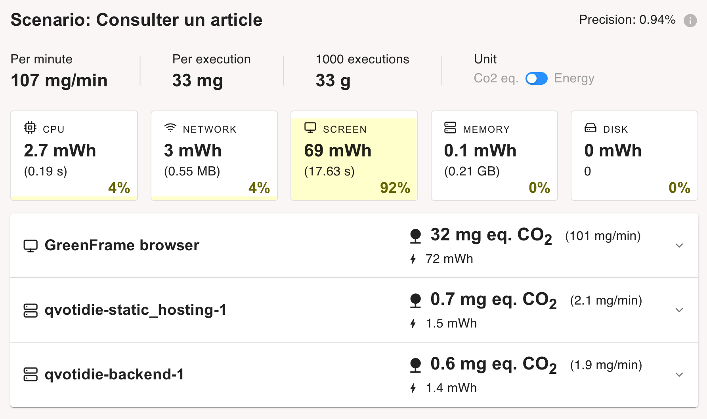
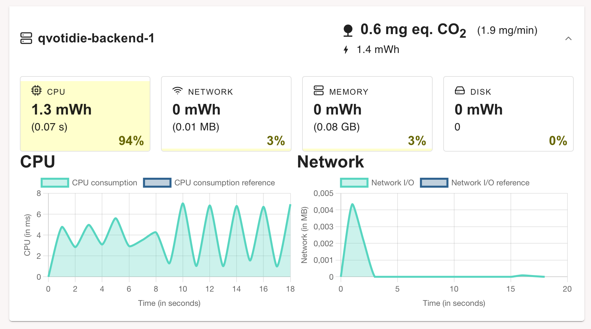
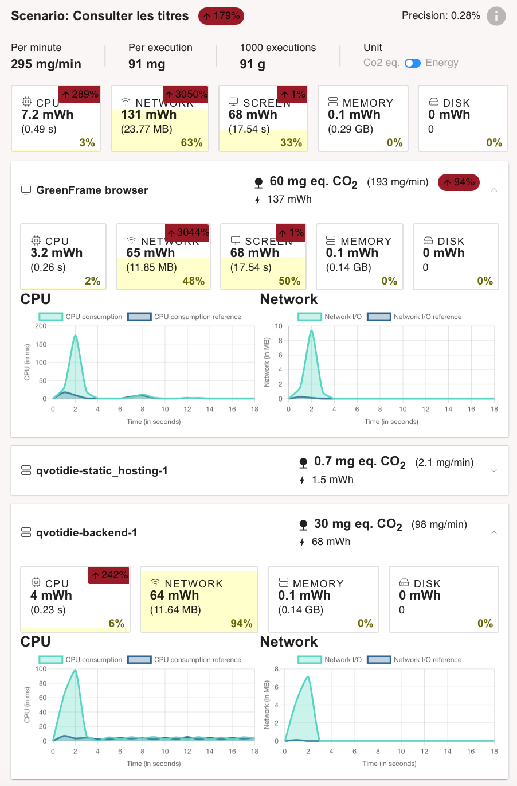

# Réduction de l'impact écologique du service numérique d'un quotidien national d'information

## Choix du sujet

Personnellement, la consultation (sur smartphone et ordinateur portable) d'un quotidien national représente environ 3h par semaine de mon "temps d'écran". Il m'a donc semblé pertinent de veiller à réduire son impact écologique.

Au-delà de mon simple exemple personnel, la presse quotidienne nationale, tous supports confondus,  représentait au premier semestre de cette année 8 millions de lecteurs ([source : ACPM](https://www.acpm.fr/Les-chiffres/Audience-Presse/Resultats-par-etudes/OneNext2/Presse-Quotidienne-Nationale)). Par ailleurs, parmi ces consultations, la part du numérique, oscille entre 30 et 80% selon les titres ([source : ACPM](https://www.acpm.fr/Les-chiffres/Audience-Presse/Resultats-par-etudes/OneNext-Global)).

## Utilité sociale

Les services qui ont le moins d'impact sont bien-sûr ceux qui n'existent pas ou plus. Cependant, dans le cas de la presse, leur utilité sociale est assez indiscutable. 

"La liberté de la presse est [...] constitutive de la démocratie". Grâce à elle, "chaque citoyen[ne] peut [...] prendre connaissance des politiques menées, les juger [...], découvrir les propositions alternatives des opposants" ([source : Service du Premier ministre](https://www.dila.premier-ministre.gouv.fr/actualites/presse/communiques/article/medias-et-democratie)).
Notons que cette liberté requiert le respect de la déontologie du métier de journaliste : vérification des faits, indépendance face aux groupes de pression.
Dans une période où le journalisme traditionnel est concurrencé par des médias qui ne partagent pas forcément la même déontologie, l'utilité sociale du journalisme nous semble encore renforcée.

## Effets de la numérisation

La numérisation de la presse quotidienne nationale a entraîné une substitution partielle par rapport au papier (entre 30 et 80% comme nous le disions plus haut). Malgré la création de nouveaux titres purement numériques de presse écrite, il ne semble pas qu'il y ait eu d'effet rebond puisqu'au contraire la diffusion totale de la presse en France s'est érodée de 30% en dix ans ([source: Rapport du Sénat](https://www.senat.fr/rap/r21-805/r21-805_mono.html#toc51)).

Le bilan en termes d'impact écologique de la substitution du papier par le numérique n'est pas facile à établir. On connaît à peu près l'impact en gaz à effets de serre de la production de l'exemplaire papier d'un quotidien régional : 200g eq. CO2 ([source : La Croix](https://www.la-croix.com/Est-ecolo-sinformer-papier-ecran-2020-11-19-1201125441)), celui d'un quotidien national est sans doute un peu supérieur en raison du transport. L'impact de la consultation d'une page Web est de l'ordre du gramme. Pour un nombre d'articles consultés de l'ordre de la dizaine, on pourrait donc penser que la numérisation réduit l'impact d'un facteur 10. Ceci est grandement à relativiser car le "taux de circulation" varie entre 4 et 8 lecteurs par exemplaire papier ([source : Wikipédia](https://fr.wikipedia.org/wiki/Presse_en_France#Lectorat_et_taux_de_circulation)).
Retenons que dans le cas qui nous occupe le support numérique est potentiellement plus vertueux que le support papier, mais que ce gain risque d'être annulé :

- si le service numérique encourage la consultation d'un nombre élevé d'articles, 
- s'il encourage fortement le partage à d'autres lecteurs,
- si l'impact des pages est supérieur à la moyenne. 

Nous serons donc particulièrement attentifs à ces trois risques dans la conception et le prototypage qui vont suivre.

## Scénarios d'usage et impacts

Nous faisons l'hypothèse que le journal est lu plusieurs fois dans la journée lors de moments de pause de quelques dizaines de minutes (dans les transports en commun, après le repas de midi, avant de se coucher, etc.).
Pour cette raison, nous prendrons en compte dans notre scénario la lecture de deux articles l'un à la suite de l'autre, afin d'apprécier l'effet bénéfique du cache.

Par ailleurs nous distinguerons la lecture des articles du jour et ceux d'une rubrique (Politique, Environnement, etc.), plus spécifiques mais possiblement plus anciens.

## Scénario : "Lire des articles parmi les articles du jour"

1. Le lecteur du journal se rend sur la "une" du journal grâce à un favori (donc sans passer par un moteur de recherche). Si nécessaire, il donne son consentement. Puis il consulte les titres.
2. Il choisit un des articles et le lit jusqu'au bout.
3. Il revient aux titres de la "une" et les consulte.
4. Il choisit un autre article et le lit jusqu'au bout.

## Scénario : "Lire des articles d'une rubrique donnée"

1. Le lecteur du journal se rend sur la "une" du journal grâce à un favori (donc sans passer par un moteur de recherche).  Si nécessaire, il donne son consentement.
2. Il choisit une des rubriques. Puis il consulte ses titres.
3. Il choisit un des articles et le lit jusqu'au bout.
4. Il revient aux titres de la rubrique et les consulte.
5. Il choisit un autre article et le lit jusqu'au bout.

## Impact de l'exécution des scénarios auprès de différents services concurrents

L'EcoIndex d'une page (de A à G) est calculé (sources : [EcoIndex](https://www.ecoindex.fr/comment-ca-marche/), [Octo](https://blog.octo.com/sous-le-capot-de-la-mesure-ecoindex), [GreenIT](https://github.com/cnumr/GreenIT-Analysis/blob/acc0334c712ba68939466c42af1514b5f448e19f/script/ecoIndex.js#L19-L44)) en fonction du positionnement de cette page parmi les pages mondiales concernant :

- le nombre de requêtes lancées,
- le poids des téléchargements,
- le nombre d'éléments du document.

Nous avons choisi de comparer l'impact des scénarios sur les services de quotidiens nationaux de diverses sensibilités politiques, économiques et environementales :

- Le Figaro (bientôt),
- Le Monde,
- La Croix,
- Libération (bientôt),
- L'Humanité,
- Reporterre (à titre de comparaison, même si ce n'est pas à proprement parler un quotidien).

Les résultats sont les suivants (attention, d'une journée à l'autre, on peut observer une certaine variabilité) :

- Scénario "[Lire des articles parmi les articles du jour](https://htmlpreview.github.io/?https://raw.githubusercontent.com/UTT-GL03/QVOTIDIE/main/benchmark/benchmark.html)",
- Scénario "Lire des articles d'une rubrique donnée (bientôt)".

## Maquette de l'interface et échantillon de données

Au vu des différents services comparés, des exigences environnementales exprimées plus haut et des scénarios retenus, nous avons défini pour notre prototype une maquette de l'interface et un échantillon de données réalistes.

L'interface retenue est composée de deux types de "pages Web" :

- celle des titres des articles du jour ou d'une rubrique thématique,
- celle d'un article.

__Fig.1__: Maquette de l'interface du prototype : __a.__ type de page pour les "titres" (du jour ou d'une rubrique), __b.__ type de page d'un article.

Pour des raisons de respect des droits d'auteurs, nous utilisons des données générées (avec [`dummy-json`](https://dummyjson.com)).
Bien que fictives, ces données correspondent à la structure des services concurrents : 20 à 30 articles comportant un titre possiblement long, un auteur et une rubrique (voir [modèle de données](./frontend/sample_data.hbs)). 
Dans un objectif de sobriété environnementale, les articles sont limités à ceux du jour et de la veille.

## Prototype n°1 : Fonctionnalités pour le scénario prioritaire avec données chargées de manière statique

Pour cette première version du prototype :

- l'échantillon de données est encore chargé dans le code de manière statique,
- les fonctionnalités implémentées ne sont que celles nécessaires pour suivre le scénario prioritaire ("Lire des articles parmi les articles du jour").

Ce scénario nécessite de pouvoir naviguer entre deux types de page : la page des titres et les pages des articles.

### Page des titres

Nous avons développé la page des titres (cf. Fig. 2) pour qu'elle affiche l'échantillon de données sous une forme proche de ce que prévoyait la maquette.

__Fig.2__: Prototype de la page des titres.

Pour l'instant, nous avons choisi un *framework* de mise en page minimaliste ([*PicoCSS*](https://picocss.com)).
Dans la suite du projet, nous verrons si l'impact environnemental du passage à un *framework* de mise en page plus puissant (comme [*Bootstrap*](https://getbootstrap.com)) est acceptable.

De même, nous avons décidé, contrairement à l'ensemble des services concurrents, de ne pas inclure de photographies dans cette page.
Même si ces photographies ont probablement un impact sur l'attention portée à un article, elles ne sont pas strictement requises pour la consultation des titres et ne sont donc pas incluses dans le produit minimum viable.
Si une telle fonctionnalité devait par la suite être introduite, il faudrait mettre en balance son utilité et son impact *a priori* important.
En effet, à moins de mettre en place des techniques avancées d'optimisation (et possiblement ambivalentes) comme les [*sprites* en CSS](https://fr.wikipedia.org/wiki/Sprite_(jeu_vidéo)#Sprite_CSS) ou le multiplexage dans [HTTP/2](https://en.wikipedia.org/wiki/HTTP/2) (cf. Wikipédia), une requête supplémentaire est nécessaire pour chaque image.

Dans l'état actuel du prototype, il est possible d'avoir une première idée de l'impact environnemental du *frontend*.
Bien entendu, il manque encore le chargement dynamique des données, mais nous pouvons déjà évaluer l'impact de l'affichage des données et du *framework* (au sens large : *React*, *PicoCSS*, *DayJS*).
Cette évaluation de l'impact (cf. Tab.1) est déjà encourageante en mode "développement" mais encore plus en mode "pré-production".
Nous mesurons ici l'effet positif de l'adoption d'outils de développement Web intégrant la ["minification"](https://fr.wikipedia.org/wiki/Minification) (cf. *Wikipédia*) du code et la concaténation du code d'une part et des feuilles de style d'autre part.

|   | EcoIndex| GES (gCO2e) | Taille du DOM | Requêtes | Taille de la page (ko)
|---|--------:|------------:|--------------:|---------:|---------------------:
| Mode "développement"  | 80 A🟢 |  1,4 | 144 | 21 | 1494
| Mode "pré-production" | 90 A🟢 | 1,2 | 141 | 4 | 94

__Tab.1__: Évaluation de l'impact du prototype de la page d'accueil.

### Pages des articles

Les pages des articles ont pour HTTP-URI `/{id}`.
Comme l'échantillon de données ne comportait pas d'identifiants pour les articles, nous avons adopté pour l'instant leur horodatage en tant qu'identifiant.

De même que précédemment, nous avons tenté d'implémenter cette page (cf. Fig. 3) conformément à ce que prévoyait la maquette.
Notons que nous n'avons pas inclu le choix des rubriques puisque cette fonctionnalité n'est pas incluse dans le scénario prioritaire.

__Fig.3__: Prototype de la page d'un article.

Avec l'ajout de ce modèle de page et la mise en place de la navigation entre les deux modèles, il devient possible d'exécuter le scénario prioritaire complet et de mesurer son impact.

|   | EcoIndex| GES (gCO2e) | Taille du DOM | Requêtes | Taille de la page (ko)
|---|--------:|------------:|--------------:|---------:|---------------------:
| 1. Consulter les titres 					   | 89 A🟢 | 1,2 | 166 | 4 | 102
| 2. Choisir et lire un article 			   | 95 A🟢 | 1,1 |  31 | 4 | 102
| 3. Revenir aux titres et les consulter	| 89 A🟢 | 1,2 | 166 | 4 | 102
| 4. Choisir et lire un autre article 		| 95 A🟢 |  1,1|  29 | 4 | 102

__Tab.2__: Évaluation de l'impact du scénario "Lire des articles parmi les articles du jour" dans le prototype n°1.

Ces estimations bien qu'artificiellement basses (puisque les données sont chargées de manière statique) sont tout de même à comparer avec [celles des services concurrents](https://htmlpreview.github.io/?https://raw.githubusercontent.com/UTT-GL03/QVOTIDIE/main/benchmark/benchmark.html) vues précédemment.

Si nous arrivons à maintenir les émissions en dessous de 1,5 g pour notre produit minimum viable, nous pouvons donc espérer proposer une alternative 2 à 3 fois moins impactante que les services existants.

## Prototype n°2 : Fonctionnalités pour le scénario prioritaire avec données statiques chargées de manière dynamique

Pour cette deuxième version du prototype, les données (toujours statiques) sont désormais chargées par le *frontend* à travers le réseau immédiatement après un premier affichage à vide.
Ce comportement, plus réaliste, n'a pour effet qu'une requête supplémentaire par page affichée. 

Concernant l'évaluation de l'impact environemental du scénario, par rapport au tableau précédent (cf. Tab.2), à l'exception du nombre de requêtes qui est incrémenté de 1, les résultats sont strictement identiques.
D'ailleurs, à partir de cette version, et à moins de changements profonds, l'EcoIndex ne devrait plus évoluer de manière significative.
Nous utiliserons désormais un autre logiciel, *GreenFrame*, qui évalue non pas l'impact "environné" de la consultation (incorporant une participation au cycle de vie du terminal) mais celui de la consultation proprement dite (cf. Tab.3) et de manière beaucoup plus fiable à partir des statistiques d'utilisation des ressources physiques (CPU, mémoire, réseau, disque).

| | Impact de la consultation des titres | Impact de la consultation d'un article
|--------------|----:|---------:
| Le Figaro    | 227     | [85, 96]
| Libération   | 152     | 105
| L'Humanité   | 145     | 186
| La Croix     | 139     | 120
| Le Monde     | 133     | [60, 307]
| Reporterre   | 84      | 66
| __QVOTIDIE__ | __32__  | __33__

__Tab.3__ : Impact en mg CO2e de la consultation proprement dite des pages des services existants et de notre prototype.

Pour les services existants, sur le graphique présentant l'utilisation dans le temps des ressources (cf. Fig.4), on constate d'autres pics que le pic initial, probablement associés au chargement et à l'affichage de contenus multimédias et de publicités, ou causés par des techniques de pistage sur le Web.

__Fig.4__: Consommation de ressources lors de la consultation de la page des titres du journal *Le Monde*.

Pour notre prototype, au contraire, le graphique (cf. Fig.5) présente un unique pic significatif de consommation de CPU et de réseau.
Notons par ailleurs que le pic de CPU est 25 fois plus faible que celui de la figure précédente.
Par ailleurs, nous remarquons que cette consommation ne compte que pour 7% de la consommation totale, le reste étant consommé par l'écran durant la durée de la mesure.

__Fig.5__ : Consommation de ressources par le navigateur lors de la consultation de la page des titres dans notre prototype.

Par ailleurs, il nous est possible désormais d'évaluer l'impact écologique de la partie "serveur", possiblement hébergée par un *data center* (cf. Fig.6).
Réduite au simple hébergement de données statiques sur un serveur Web, cette partie a pour l'instant un impact très faible et quasi négligeable (3%) par rapport à la partie "client" . 

__Fig.6__ : Consommation de ressources par le serveur Web lors de la consultation de la page des titres dans notre prototype.

## Prototype n°3 : Fonctionnalités pour le scénario prioritaire avec données stockées dans une base de données

Pour la troisième version du prototype, les données sont désormais stockées dans un système de base de données interrogeable à travers une API Web (*CouchDB*).
L'intérêt d'une source de données dynamique est d'une part, à terme, de pouvoir ajouter ou modifier des articles plus facilement, et d'autre part de déporter sur le serveur le filtrage des données pertinentes.

Sur ce deuxième enjeu, on observe effectivement dans les mesures (cf. Fig.7) une baisse de la charge du réseau (de 740 à 550 ko) entre les deux prototypes concernant la consultation d'un article.

__Fig.7__ : Comparaison de l'impact de la consultation de la page d'un article entre les prototypes 2 (en haut) et (3 en bas).

Cette baisse d'impact du réseau est cependant largement compensée par une utilisation du CPU par la base de données, utilisation qui semble par ailleurs continue (cf. Fig.8).

__Fig.8__ : Profil dans le temps de l'impact de la base de données lors de la consultation de la page d'un article.

De ces différentes mesures, nous pouvons retenir que l'effet de l'introduction d'une base de données, quoique négligeable, est, pour l'instant, plutôt défavorable d'un point de vue écologique.
Le bilan de ce changement devrait cependant rapidement s'inverser avec l'augmentation de la quantité de données gérées.

## Prototype n°4 : Fonctionnalités pour le scénario prioritaire avec filtrage des données

### Passage à l'échelle

Dans le cas qui nous occupe de la presse quotidienne et dans le cadre des fonctionnalités envisagées (consultation d'articles), l'augmentation de la quantité des données à traiter ne viendra ni de l'augmentation du nombre de journalistes ni même de celle  des lecteurs.
Par contre, il est d'usage sur les applications de presse d'avoir accès aux archives du journal,
le but étant d'éclairer l'actualité à la lumière du passé plus ou moins proche.
Cette exigence fonctionnelle bien que coûteuse du point de vue environnemental nous semble contribuer grandement à l'utilité sociale de la plateforme.
Par conséquent nous adopterons également ce choix de conception.

L'augmentation du volume d'articles est linéaire : à raison de 25 nouveaux articles par jour, la base de données sera de 3000 articles au bout de 4 mois (et ainsi de suite).

### Évolution de l'impact environnemental avant correction

La figure 9 illustre l'impact du passage à l'échelle de 30 à 3000 articles de presse (correspondant à 4 mois de publication du quotidien).
On observe, sur le *backend*, une multiplication par 3,5 de l'impact du processeur, et surtout, concernant l'impact du réseau, une multiplication par 31 pour le *frontend* et une explosion non quantifiable (de 0 à 64 mWh) pour le *backend*.

__Fig.9__ : Évolution de l'impact de la consultation de la page des titres en passant de 30 articles à 3000 (soit 4 mois d'historique).

L'évolution ne concerne bien sûr que la page des titres, puisque c'est la seule qui charge l'ensemble des articles.

